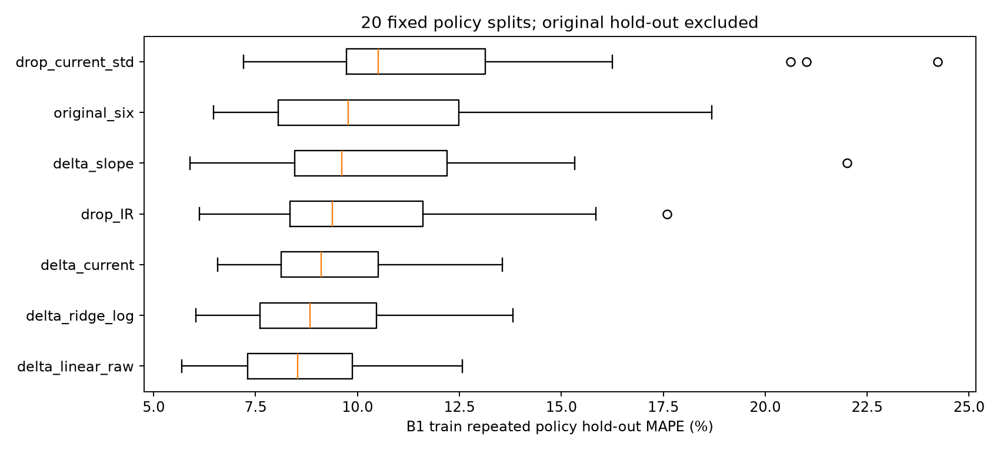
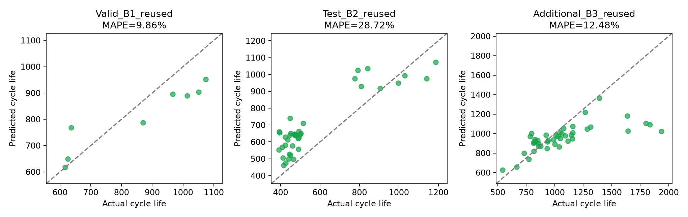

> 이전 개선 단계의 기록입니다. 현재 기본 모델과 실행 방법은 [README.md](README.md), 최신 실험은 [IMPROVEMENT.md](IMPROVEMENT.md)를 참고하세요.

# DAY 2 후속 실험과 남은 점검 완료

최종 후속 모델은 **log ΔQ 분산 한 변수의 Linear 회귀(원본 타깃)**다. 학습 28셀 안에서 20회 정책 그룹 분할의 평균 MAPE로 선택했다. Batch 2 재사용 평가 MAPE는 **28.72%**, 예비 Ridge 61.25%보다 낮다. 목표 9.1%에는 미달한다. 외부 테스트는 이미 본 자료이므로 이 개선을 새 독립 테스트 성능으로 표현하지 않는다.

## 실험 설계

예비 외부 평가를 이미 본 뒤 수행한 후속 분석이다. 그 이력을 숨기지 않는다. 원래 학습 28셀/15정책에서만 seed 0–19의 정책 그룹 hold-out(정책 25%)을 생성했다. 기존 hold-out 8셀과 B2/B3는 후속 후보 선택에 사용하지 않았다. 7개 고정 후보를 같은 분할에서 비교하고 평균 MAPE 최소값으로 선택했다. Ridge alpha=1을 고정했으며 외부 점수로 파라미터를 조정하지 않았다. 선택·모델 저장 후 외부 점수를 다시 계산했다.

| 후보 | 특징 수 | 20회 평균 MAPE | 표준편차 | 최대 MAPE | 예비 6변수보다 낮은 분할 |
| --- | ---: | ---: | ---: | ---: | ---: |
| delta_linear_raw | 1 | 8.69% | 1.98 | 12.57% | 15/20 |
| delta_ridge_log | 1 | 8.94% | 2.03 | 13.82% | 15/20 |
| delta_current | 2 | 9.41% | 1.79 | 13.55% | 14/20 |
| drop_IR | 5 | 10.28% | 2.98 | 17.59% | 9/20 |
| delta_slope | 2 | 10.65% | 3.79 | 22.01% | 11/20 |
| original_six | 6 | 10.67% | 3.43 | 18.70% | 0/20 |
| drop_current_std | 5 | 12.42% | 4.62 | 24.24% | 2/20 |

분할들은 셀을 반복 사용하므로 독립 실험 20개나 신뢰구간으로 해석하지 않는다. 한 변수 모델의 단순성과 이 자료 안의 안정성을 확인한 결과다. 전류 특징만 제거하면 오히려 악화돼 개별 변수 삭제와 전체 중복 축소의 효과가 같지 않았다.



## 최종 후속 모델 성능

| 구분 | MAPE (%) / Gap (%p) | 비고 |
| --- | ---: | --- |
| Train (Batch 1 CV) | 9.03 ± 0.72 | 기존 고정 3-fold; 후속 선택 후 진단 |
| Valid (Batch 1 Hold-out) | 9.86 | 이전에 본 8셀; 후속 선택에는 미사용 |
| Test (Batch 2) | 28.72 | 이전에 본 39셀; 재사용 평가 |
| Gap (Train-Valid) | +0.84 | Valid−Train, %p |
| Gap (Valid-Test) | +18.86 | Test−Valid, %p |
| Gap (Target-Test) | +19.62 | Test−9.1, %p |

Batch 3 추가 재사용 평가: **12.48%**(44셀). 선택 기준으로 쓴 20회 분할의 평균 MAPE는 8.69%다. 위 Train CV와 계산 대상·분할 방식이 다르다. 최종 모델은 `models/followup_model.joblib`, 추론 CLI의 기본 모델이다. 예비 모델과 점수는 그대로 보존했다.

중복 축소·분할 안정성·오류 하위집단·바코드 확인 결과는 [FOLLOWUP.md](FOLLOWUP.md)에 있다. 바코드 139개를 해독·대소문자 정규화한 결과 모두 고유해 **바코드 기준 배치 간 중복 0개**를 확인했다.



## 오류 원인 가설의 구체화

예비 Ridge의 IR 결측 6셀 MAPE는 46.74%, IR 관측 33셀은 63.89%다. IR 결측만으로 전체 실패를 설명할 수 없다. 학습 최댓값보다 충전 시간이 긴 10셀은 평균 오차 -377.1사이클(과소 예측), 나머지 29셀은 +249.9사이클(과대 예측)이었다. 충전 시간의 학습 범위 이탈과 예측 방향 차이를 확인했지만 교란 변수를 통제한 인과 검증은 아니다.

`batch2_prediction_contributions.csv`는 예비 Ridge의 표준화 특징×계수를 log10 예측 공간에서 계산했다. 절편과 기여도의 합을 역변환하면 저장 예측값과 일치한다. 통계적 모델의 계산 기여도이며 물리적 인과 효과가 아니다. 후속 Linear는 이 보조 특징들을 쓰지 않아 이 경로의 분포 이동 영향을 줄였다.

| 모델 | Valid B1 | B2 재사용 평가 | B3 추가 재사용 평가 |
| --- | ---: | ---: | ---: |
| 예비 Ridge, 6변수 | 9.84% | 61.25% | 15.67% |
| 후속 Linear, 1변수 | 9.86% | 28.72% | 12.48% |

후속 모델도 짧은 수명을 과대 예측한다. 가장 큰 상대 오차 사례:

- b2c6: 실제 393, 예측 660.5사이클, APE 68.1%.
- b2c15: 실제 396, 예측 654.3사이클, APE 65.2%.
- b2c18: 실제 449, 예측 740.0사이클, APE 64.8%.

## 바코드·채널 메타데이터 감사

스칼라 MATLAB 문자열 객체의 MCOS 참조를 따라 UTF-16 payload를 해독했다. 핸들 구조·문자열 길이·패딩·EL+12자리 형식·바코드/채널 객체 범위를 검사했다. 셀 139개, 정규화 바코드 139개이며 중복 0개다. 필드값 기준 교차 배치 동일 셀 의심은 해소했다. 이 검사는 실험실의 물리적 추적 장부까지 확인한 것은 아니다. DAY 1 제출 문서는 수정하지 않았다.

Batch 3의 channel46은 b3c37이며 [논문 공개 로딩 코드](https://github.com/rdbraatz/data-driven-prediction-of-battery-cycle-life-before-capacity-degradation/blob/master/LoadData.m)의 최초 제외 인덱스(38번째 셀)와 대응한다. 순차 규칙도 원본 순서에 대응시켰다: channel46(b3c37) 제외 → 마지막 용량>0.885Ah(b3c23, b3c32) 제외 → 남은 배열의 3·40·41번째(b3c2, b3c42, b3c43) 제외. 40셀 부분집합을 별도 민감도 자료로 저장했다. 기본 B3 점수는 기존 유효 타깃 44셀을 유지하며 부분집합을 근거로 모델을 다시 선택하지 않는다. 이는 현재 파일에 공개 코드의 규칙을 대응시킨 결과이지 원논문 데이터 버전의 완전 동일성 증명은 아니다. B2의 날짜는 논문 코드의 2017-06-30과 다른 2018-02-20으로, 바코드가 고유하다는 결과만으로 논문과 같은 분할이 되는 것은 아니다.

공개 규칙 대응 40셀의 B3 재사용 민감도 MAPE는 예비 Ridge 15.24%, 후속 Linear 12.58%다. 기본 44셀 점수와 구분하여 기록했다.

## 검증·재현

```sh
.venv/bin/python robustness.py
.venv/bin/python summarize.py
.venv/bin/python verify.py
```

원본 바코드 재확인: `.venv/bin/python audit_identity.py --raw-dir raw`. 결과는 `results/cell_identity.csv`, `identity_audit.json`에 있다. 후속 선택 프로토콜, 140개 후보·분할 점수, 독립 재학습 검증과 원본 모델 보존 해시는 `results/followup_*`, `policy_stability_*`, `ablation_paired.csv`에 보존했다.

추가 데이터 수집과 실제 BESS 현장 검증은 과제의 로컬 분석으로 완료할 수 없다. 현재 자료에서 수행할 수 있는 특징 축소·정책 안정성·오류 진단·메타데이터 확인·재현 검증은 완료했다.
