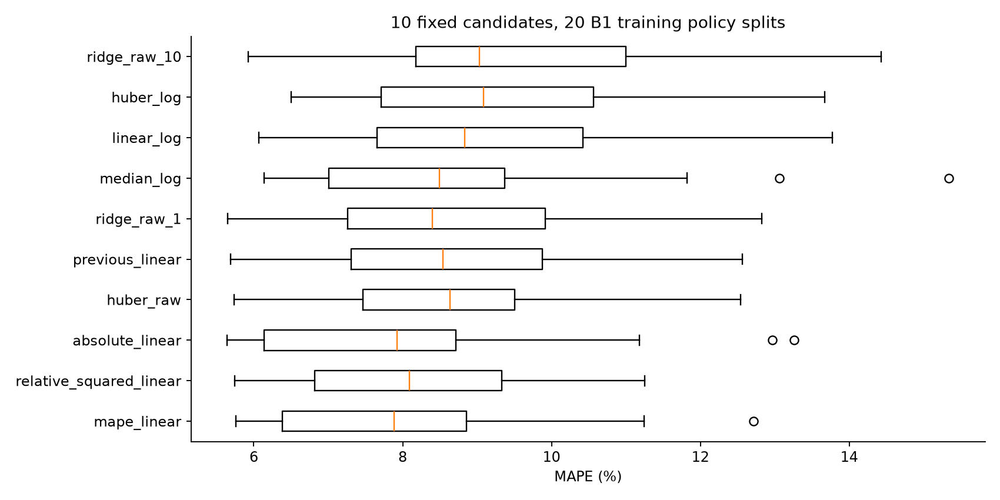

# DAY 2 추가 개선 — MAPE 목적함수와 선택 절차 검증

최종 모델은 **초기 ΔQ 분산 한 변수의 MAPE 가중 선형 회귀**다. 학습 28셀에서 정책별 20회 분할로 10개 후보를 비교했다. 선택 평균 MAPE는 8.05%로, 이전 Linear 8.69%보다 낮다. Batch 2 재사용 평가 MAPE는 **25.12%**(이전 28.72%)다. 목표 9.1%는 미달이며 Hold-out과 Batch 3은 소폭 악화됐다. 이미 본 자료의 재평가이므로 새 독립 테스트 성능으로 주장하지 않는다.

## 변경 이유와 구현

이전 Linear는 제곱 오차를 최소화했지만 과제는 MAPE를 평가한다. 정답 y가 양수이면 MAPE 목적함수는 `sum(abs(y-p)/y)`다. `QuantileRegressor(quantile=0.5, alpha=0)`에 각 학습 fold의 `1/y` 가중치를 주면 같은 최소값을 갖는 가중 절대 오차 선형 회귀가 된다. 가중치는 평균 1로 정규화한다. 검증·외부 정답은 가중치나 전처리 계산에 쓰지 않는다. 입력은 기존 `log_dq_var` 하나를 유지했다.

비교 후보는 기존 Linear, 상대 제곱 오차 가중 Linear(1/y²), MAPE 가중 Linear, 비가중 절대 오차 Linear, 원본·log 타깃 Huber, log 타깃 중앙값 회귀, log 타깃 Linear, 원본 타깃 Ridge(alpha=1/10) 총 10개다. 후보 목록·가중치·분할은 외부 재평가 전에 저장했다. 반복 분할 평균 MAPE 최솟값으로 선택했으며 B2 성능으로 후보를 다시 바꾸지 않았다.

| 후보 | 20회 평균 MAPE (%) | 표준편차 | 최대 |
| --- | ---: | ---: | ---: |
| mape_linear | 8.05 | 1.90 | 12.71 |
| relative_squared_linear | 8.17 | 1.64 | 11.25 |
| absolute_linear | 8.19 | 2.22 | 13.26 |
| huber_raw | 8.63 | 1.89 | 12.54 |
| previous_linear | 8.69 | 1.98 | 12.57 |
| ridge_raw_1 | 8.73 | 2.05 | 12.83 |
| median_log | 8.80 | 2.39 | 15.34 |
| linear_log | 8.96 | 2.01 | 13.78 |
| huber_log | 9.19 | 2.04 | 13.67 |
| ridge_raw_10 | 9.76 | 2.37 | 14.43 |

반복 분할은 셀을 공유한다. 20개의 독립 표본이나 유의성 검정 근거로 해석하지 않는다.



## 모델 선택을 포함한 검증

모델 후보를 고른 동일 분할의 점수는 선택 편향을 포함한다. 이를 점검하려고 **3개 바깥 정책 fold 각각의 학습 부분에서 20회 분할·10개 후보 선택을 다시 수행**했다. 바깥 검증 셀·정책은 내부 선택과 전처리에 들어가지 않는다. 이 선택 절차의 바깥 CV 평균 MAPE는 **8.64 ± 1.20%**, 같은 바깥 fold의 이전 Linear는 9.03%다. 바깥 fold의 선택 모델은 서로 다르다. 이는 최종 고정 모델의 CV 7.91% 및 후보 선택용 20회 평균과 다른 지표다. B1 데이터와 기존 분할 자체를 이전 작업에서 확인한 이력이 있으므로 이 역시 내부 진단이며 새 독립 검증이 아니다.

## 성능과 변화

| 구분 | MAPE (%) / Gap (%p) | 비고 |
| --- | ---: | --- |
| Train (Batch 1 CV) | 7.91 ± 2.32 | 고정 3-fold; 선택 후 진단 |
| Valid (Batch 1 Hold-out) | 10.63 | 8셀, 선택에 미사용; 이전에 본 자료 |
| Test (Batch 2) | 25.12 | 39셀, 재사용 평가 |
| Gap (Train-Valid) | +2.73 | Valid−Train, %p |
| Gap (Valid-Test) | +14.48 | Test−Valid, %p |
| Gap (Target-Test) | +16.02 | Test−9.1, %p |

Batch 3 추가 재사용 평가: **12.93%**(44셀). MAPE는 셀별 상대 오차의 평균이고 Gap은 퍼센트포인트다. CV 표준편차는 3개 fold의 산포이며 신뢰구간이 아니다.


| 모델 | B1 Hold-out | B2 재사용 | B3 재사용 |
| --- | ---: | ---: | ---: |
| 예비 Ridge, 6변수 | 9.84% | 61.25% | 15.67% |
| 이전 Linear, 1변수 | 9.86% | 28.72% | 12.48% |
| MAPE 가중 Linear, 1변수 | 10.63% | 25.12% | 12.93% |


B2 개선은 약 3.60%p지만 모든 평가 집합에서 좋아진 결과는 아니다. B1 Hold-out은 +0.77%p, B3는 +0.44%p 변했다. 이번 모델 채택 근거는 B1 내부의 사전 지정 선택 규칙이며, 외부 점수로 선택한 것이 아니다. 이전 모델은 별도 파일로 유지했다.


큰 B2 오류 사례:

- b2c6: 실제 393, 예측 640.4사이클, APE 63.0%.
- b2c18: 실제 449, 예측 720.8사이클, APE 60.5%.
- b2c15: 실제 396, 예측 634.2사이클, APE 60.2%.

## 추론 진단과 한계

`predict.py --diagnostics`는 특징의 학습 최솟값·최댓값 이탈, 특징 결측 수, 예측 수명의 학습 타깃 범위 이탈을 표시한다. 수명 학습 범위는 534–1054사이클이다. 범위 표시 자체는 예측 구간, 오류 확률, 안전 판정이 아니다. 예측값을 학습 범위로 잘라 성능을 바꾸지 않는다. 실제 수명이 필요 없는 초기 특징 CSV로 실행된다.

단수명 과대 예측과 배치 이동은 남아 있다. 현재 점수로 실제 ESS 교체 시점·안전성·비용 절감을 보장할 수 없다. 현장 적용에는 단수명 표본과 별도 배치 검증, SOH 감시가 필요하다.

## 재현·검증

`improve.py`는 200개 기본 후보·분할 학습과 600개 내부 중첩 후보·분할 학습을 수행한다. `verify_improvement.py`가 800개를 다시 학습하고 정책 분리·선택·저장 예측·평가 지표·Gap을 대조한다. 선택된 MAPE 가중 모델의 학습 목적함수 최솟값은 별도 원본 입력 선형계획법으로 확인한다. 기존 예비·후속 모델과 예측 해시, DAY 1 파일 40개 해시도 대조한다. 기계 기록은 `results/improvement_validation.json`이다.

```sh
python improve.py
python summarize_improvement.py
python verify.py
python predict.py --input data/features.csv --output tmp/predictions.csv --diagnostics
python package.py
```
