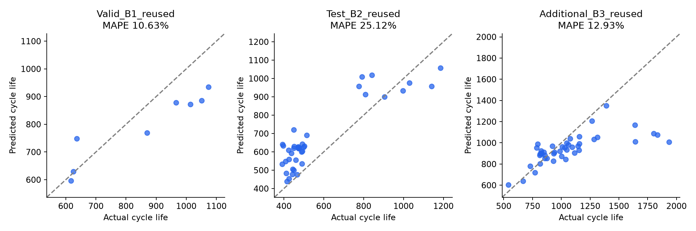

# ESS 배터리 수명 예측 — DAY 2

울산 4반 박세웅 (U115) | 초기 100사이클로 총 수명 `cycle_life` 회귀 예측

최종 모델은 **초기 ΔQ 분산 한 변수의 MAPE 가중 선형 회귀**다. 학습 28셀에서 정책별 20회 분할로 10개 후보를 비교했다. 선택 평균 MAPE는 8.05%로, 이전 Linear 8.69%보다 낮다. Batch 2 재사용 평가 MAPE는 **25.12%**(이전 28.72%)다. 목표 9.1%는 미달이며 Hold-out과 Batch 3은 소폭 악화됐다. 이미 본 자료의 재평가이므로 새 독립 테스트 성능으로 주장하지 않는다.

## 프로젝트 개요와 EDA → 구현

데이터는 MIT–Stanford 배터리 자료다. Batch 1(2017-05-12)로 학습·검증하고 Batch 2(2018-02-20)로 필수 평가, Batch 3(2018-04-12)로 추가 평가한다. 셀 139개 중 유효 수명은 129개다.

| DAY 1 발견 | 모델 설계·구현 |
| --- | --- |
| B1의 <550사이클 셀은 1/46 | 분류 대신 총 수명 회귀; 단수명 일반화 한계 명시 |
| 수명 중앙값 B1/B2/B3 = 858.5/472/1005.5 | B1 학습, B2 외부 평가, B3 추가 평가 |
| 말기 열화 가속·knee 후보 관측 | 전체 곡선·knee를 입력에서 제외 |
| log ΔQ 분산–수명 Spearman = −0.871/−0.709/−0.797 | Q100(V)−Q10(V)의 log 분산 사용 |
| 충전 조건–수명 관계는 배치별로 다름 | 정책 문자열은 입력 대신 분할 그룹으로 사용 |
| ΔQ 특징 간 중복 0.971–0.989 | 한 변수 모델과 다변수 정규화 모델 비교 |
| B1 종료 경고 10셀, B2 IR=0인 유효 수명 6셀 | 경고 셀 학습 제외, IR=0은 결측; 최종 모델은 IR 미사용 |

예비 6개 초기 특징의 정의·원본 재추출은 [data/README.md](data/README.md), 이전 실험은 [FOLLOWUP.md](FOLLOWUP.md)에 있다. 이전 문서는 해당 실험 시점의 기록이며 현재 기본 모델은 아래 개선 모델이다.

## 분할·파이프라인·모델 선택

B1 46셀에서 종료 경고 10셀을 제외한 36셀을 정책 그룹 hold-out(seed=42)으로 나눴다. 학습 28셀/15정책, 검증 8셀/5정책이다. 학습·검증 및 CV 양쪽에 셀·정책 교집합이 없다. CV에서도 정책 그룹을 분리한다. 무작위 셀 분리만으로 같은 정책의 양쪽 포함을 막을 수 없기 때문이다.

학습 중앙값 결측 대체 → 표준화 → 회귀 모델을 각 fold 안에서 fit한다. 최종 입력은 `log_dq_var` 하나다. 전체 관측 길이, 미래 열화, knee, 배치·셀 ID, 정책은 입력이 아니다. B2/B3는 fit·선택에 쓰지 않았다. 타깃 결측 10셀은 평가에서 제외하고 예측만 저장한다.

예비 단계에서 DummyMedian, Linear, Ridge, ElasticNet, 얕은 RandomForest와 원본/log 타깃을 비교했다. 특징 축소 후 추가 개선에서는 고정된 10개 후보를 정책별 20회 분할로 비교했다. 최종 `QuantileRegressor(quantile=0.5, alpha=0)`는 `1/y` 가중 절대 오차로 MAPE와 같은 목적함수를 최소화한다. 가중치도 해당 fold의 학습 정답만으로 계산한다. 상세 선택 근거와 전체 후보는 [IMPROVEMENT.md](IMPROVEMENT.md)에 있다.

모델 후보를 고른 동일 분할의 점수는 선택 편향을 포함한다. 이를 점검하려고 **3개 바깥 정책 fold 각각의 학습 부분에서 20회 분할·10개 후보 선택을 다시 수행**했다. 바깥 검증 셀·정책은 내부 선택과 전처리에 들어가지 않는다. 이 선택 절차의 바깥 CV 평균 MAPE는 **8.64 ± 1.20%**, 같은 바깥 fold의 이전 Linear는 9.03%다. 바깥 fold의 선택 모델은 서로 다르다. 이는 최종 고정 모델의 CV 7.91% 및 후보 선택용 20회 평균과 다른 지표다. B1 데이터와 기존 분할 자체를 이전 작업에서 확인한 이력이 있으므로 이 역시 내부 진단이며 새 독립 검증이 아니다.

## 성능 결과

| 구분 | MAPE (%) / Gap (%p) | 비고 |
| --- | ---: | --- |
| Train (Batch 1 CV) | 7.91 ± 2.32 | 고정 3-fold; 선택 후 진단 |
| Valid (Batch 1 Hold-out) | 10.63 | 8셀, 선택에 미사용; 이전에 본 자료 |
| Test (Batch 2) | 25.12 | 39셀, 재사용 평가 |
| Gap (Train-Valid) | +2.73 | Valid−Train, %p |
| Gap (Valid-Test) | +14.48 | Test−Valid, %p |
| Gap (Target-Test) | +16.02 | Test−9.1, %p |

Batch 3 추가 재사용 평가: **12.93%**(44셀). MAPE는 셀별 상대 오차의 평균이고 Gap은 퍼센트포인트다. CV 표준편차는 3개 fold의 산포이며 신뢰구간이 아니다.


| 모델 | B1 Hold-out | B2 재사용 | B3 재사용 |
| --- | ---: | ---: | ---: |
| 예비 Ridge, 6변수 | 9.84% | 61.25% | 15.67% |
| 이전 Linear, 1변수 | 9.86% | 28.72% | 12.48% |
| MAPE 가중 Linear, 1변수 | 10.63% | 25.12% | 12.93% |




## 오류 분석과 ESS 해석

B2 MAPE는 이전 모델보다 3.60%p 낮지만 Hold-out·B3은 소폭 악화됐다. 목표 대비 차이는 16.02%p다. 기존 수명 학습 범위는 534–1054사이클이고 B2 39셀 중 30셀은 이보다 짧다. 짧은 수명을 과대 예측하는 문제가 남는다.

- b2c6: 실제 393, 예측 640.4사이클, APE 63.0%.
- b2c18: 실제 449, 예측 720.8사이클, APE 60.5%.
- b2c15: 실제 396, 예측 634.2사이클, APE 60.2%.

작은 표본·학습 수명 범위 밖의 셀·정책 및 특징 분포 이동은 오류 원인 가설이다. 인과 설명으로 확정하지 않는다. 예비 6변수 Ridge의 IR 결측·충전 시간 범위 이탈 진단은 [FOLLOWUP.md](FOLLOWUP.md)에 보존했다.

ESS 셀 선별·교체 계획의 후보 정보로 사용할 수 있지만, 단수명 과대 예측은 교체를 늦출 수 있다. 운영 적용에는 해당 화학계·온도·부하의 별도 검증과 단수명 표본, 예측 불확실성 평가·SOH 감시가 필요하다. CLI의 범위 이탈 표시는 이러한 검토를 돕는 진단이며 신뢰구간이나 안전 판정이 아니다.

## 환경 설정·재현

Python 3.11 및 `requirements.txt`의 고정 버전을 사용한다. 이 폴더를 저장소 루트로 올린다. `data/features.csv`로 원본 MAT 없이 재현 가능하다.

```sh
python3 -m venv .venv
.venv/bin/python -m pip install -r requirements.txt
.venv/bin/python train.py
.venv/bin/python robustness.py
.venv/bin/python improve.py
.venv/bin/python summarize.py
.venv/bin/python verify.py
.venv/bin/python predict.py --input data/features.csv --output tmp/predictions.csv --diagnostics
.venv/bin/python package.py
```

상위 프로젝트에서는 `.venv/bin/python day2/improve.py`처럼 실행한다. 기본 추론 모델은 `models/improved_model.joblib`다. 이전 모델은 `--model models/followup_model.joblib` 또는 `--model models/selected_model.joblib`로 지정할 수 있다. `--diagnostics`는 학습 범위 메타데이터가 있는 새 모델에서 지원한다.

## 파일·검증·제출

- `extract_features.py`, `data/features.csv`: 원본 특징 추출·재현 입력.
- `train.py`, `robustness.py`, `improve.py`: 예비·특징 축소·MAPE 개선 실험.
- `models/`: 세 단계의 저장 모델. 기존 모델·예측은 해시로 보존 확인.
- `results/`, `figures/`: 분할·후보·선택·예측·성능·검증 결과와 그림.
- `predict.py`: 초기 특징만으로 추론, 선택적 학습 범위 진단.
- `verify.py`, `verify_improvement.py`: 독립 재학습·전처리·정책 분리·목적함수·지표 검증.
- [VALIDATION.md](VALIDATION.md), [IMPROVEMENT.md](IMPROVEMENT.md): 과제 대응과 추가 개선 상세.

DAY 1 제출 파일 40개는 변경하지 않는다. DAY 2 제출물은 공개 GitHub 링크이며 반별 Slack thread로 제출한다. 로컬 ZIP은 업로드 준비용이고 공개·제출은 별도다.

## 출처·팀 구성

[과제](https://actually-war-1ea.notion.site/DS-Mini-Project-32d7f4c8669380338a27f90c471c1fcb), [데이터](https://www.kaggle.com/datasets/itshpark/data-driven-prediction-of-battery-cycle), [논문 코드](https://github.com/rdbraatz/data-driven-prediction-of-battery-cycle-life-before-capacity-degradation). Severson et al. (2019), *Nature Energy* 4, 383–391, DOI: 10.1038/s41560-019-0356-8. 파일 버전·분할 차이 때문에 논문의 정확한 재현으로 해석하지 않는다. 바코드 139개는 모두 고유하다.

박세웅: EDA, 특징 설계, 모델 개발, 평가 및 결과 검토.
